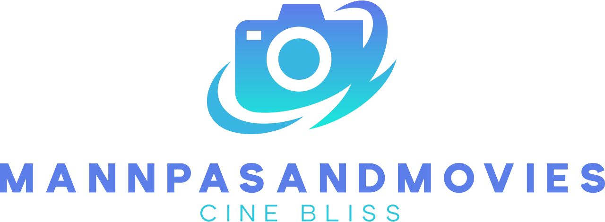
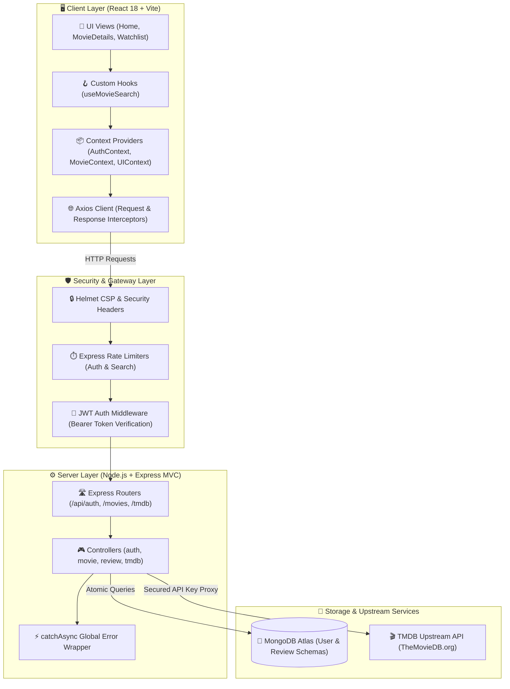

<div align="center">

  <p align="center">
    
  </p>

  # 🎬 MannPasandMovies (मनपसंद)
  ### *High-Performance Cinematic Discovery Platform with Zero-Secret Leakage Architecture*

  <p align="center">
    A production-grade, full-stack movie discovery and watchlist platform built with <strong>React 18, Node.js, Express, and MongoDB Atlas</strong>. Features rate-limited API proxying, debounced multi-page search, sliding-window pagination, hybrid JWT & Google OAuth 2.0 authentication, and a modular MVC architecture.
  </p>

  <p align="center">
    <a href="https://github.com/AdityaThakur193/ManPasandMovies-MERN/actions"></a>
    <a href="https://github.com/AdityaThakur193/ManPasandMovies-MERN/releases"></a>
    <a href="#-automated-testing--quality-metrics"></a>
    <a href="#-tech-stack"></a>
    <a href="#-security-architecture"></a>
    <a href="./LICENSE"></a>
  </p>

  <p align="center">
    <a href="#-the-why--philosophy"><strong>Explore Philosophy »</strong></a> ·
    <a href="#-system-architecture"><strong>View Architecture »</strong></a> ·
    <a href="#-quickstart--setup"><strong>Quickstart Guide »</strong></a> ·
    <a href="https://github.com/AdityaThakur193/ManPasandMovies-MERN/issues"><strong>Report Bug »</strong></a>
  </p>

</div>

---

## 📑 Table of Contents

- [🧠 The "Why" / Philosophy](#-the-why--philosophy)
- [📐 System Architecture](#-system-architecture)
- [🏛️ Deep-Dive Architectural Pillars](#-deep-dive-architectural-pillars)
- [💻 Visual UI / Showcase](#-visual-ui--showcase)
- [🛠️ Tech Stack Inventory](#️-tech-stack-inventory)
- [⚡ Quickstart & Setup](#-quickstart--setup)
- [🧪 Automated Testing & Quality Metrics](#-automated-testing--quality-metrics)
- [📁 Repository Layout Map](#-repository-layout-map)
- [🤝 Contributing & Community](#-contributing--community)
- [📄 License & Author Attribution](#-license--author-attribution)

---

## 🧠 The "Why" / Philosophy

> *"Form follows function; performance is not an afterthought, but a core architectural constraint. Modern movie discovery shouldn't trade external API key security for client responsiveness."*

Most tutorial movie applications suffer from critical architectural flaws: exposing raw third-party API keys in client-side bundles, stuffing hundreds of lines of logic into monolithic "God Components", and performing non-atomic, race-condition-prone database queries.

**MannPasandMovies** was engineered to solve these problems by adhering to four core engineering tenets:
1. **Zero Client Secret Leakage:** Third-party credentials never touch the browser; all requests are proxied and rate-limited server-side.
2. **Deterministic State Mutations:** User watchlists and likes leverage atomic MongoDB subdocument operators (`$addToSet`, `$pull`).
3. **Decoupled Separation of Concerns:** Strict MVC on the backend; dedicated custom hooks and modular presentational components on the frontend.
4. **Resilient Test Verification:** Fully covered by **77 automated unit and integration tests** utilizing an isolated, in-memory MongoDB runner.

### Architectural Comparison

| Dimension | ❌ Legacy / Tutorial Approach | ⚠️ Heavy Commercial Bloat | 🚀 MannPasandMovies Architecture |
| :--- | :--- | :--- | :--- |
| **API Key Security** | Exposed `VITE_API_KEY` in frontend bundle | Hidden behind complex multi-tier microservices | **Lightweight Express reverse proxy with prefix whitelisting** |
| **Request Throttling** | None; easily spammed / quota exhausted | Heavy global Web Application Firewalls (WAF) | **Multi-tier sliding window rate limiting (Auth vs. Search vs. Meta)** |
| **Component Design** | 800+ line monolithic pages with prop drilling | Micro-frontend overhead with complex state | **Modular presentational components + React Context API** |
| **Data Mutations** | Read-modify-write loops prone to race conditions | Distributed transactional queues | **Atomic MongoDB operators (`$addToSet`, `$pull`)** |
| **Testing Strategy** | Zero automated tests; manual QA | Slow, brittle end-to-end suites only | **Dual Jest & Vitest suites (77 tests) + In-Memory MongoDB** |

---

## 📐 System Architecture

The system utilizes an asynchronous, decoupled client-server architecture. Client requests are intercepted, validated, securely proxied, and persisted atomically.



---

## 🏛️ Deep-Dive Architectural Pillars

### 1. 🛡️ Zero-Secret Server-Side API Proxying
- **The Problem:** Modern Single-Page Applications that consume third-party APIs (like TMDB) traditionally expose API keys in client-side network headers or `.env` bundles, enabling quota theft and credential hijacking.
- **The Solution:** A dedicated Express proxy route (`/api/tmdb/*`) enforces strict path prefix whitelisting (`search/movie`, `movie/popular`, `movie`, `genre/movie/list`, `discover/movie`) and injects the private `TMDB_API_KEY` server-side.
- **Rate-Limiting Matrix:**
  - *General TMDB Proxy:* `300 requests / 5 min` per IP
  - *Search Endpoints:* `50 requests / 5 min` per IP
- **Code Path:** [`server/controllers/tmdbController.js`](file:///e:/ManPasandMovies-MERN/server/controllers/tmdbController.js) & [`server/routes/tmdb.js`](file:///e:/ManPasandMovies-MERN/server/routes/tmdb.js)

### 2. 🔐 Stateless Hybrid Authentication (JWT + Google OAuth 2.0)
- **The Problem:** Social authentication callbacks frequently leak session parameters or tokens in browser history, while traditional sessions require stateful server memory.
- **The Solution:** A hybrid authentication engine combining `bcryptjs` salted password hashing (10 rounds) with Passport.js Google OAuth 2.0. Upon successful social authentication, the backend signs a 30-day JWT and redirects to the frontend with an encoded token query parameter. React's `AuthContext` extracts the token, stores it in `localStorage`, and executes `window.history.replaceState` to scrub the URL immediately.
- **Code Path:** [`server/config/passport.js`](file:///e:/ManPasandMovies-MERN/server/config/passport.js) & [`client/src/context/AuthContext.jsx`](file:///e:/ManPasandMovies-MERN/client/src/context/AuthContext.jsx)

### 3. ⚡ Atomic Subdocument Mutation Engine
- **The Problem:** Adding or removing items from user-specific movie lists (Watchlist, Liked Movies) via standard fetch-modify-save patterns causes race conditions during rapid user clicks.
- **The Solution:** Native MongoDB array operators `$addToSet` and `$pull` execute idempotent, single-operation database updates without requiring document-level locking or multi-table SQL JOINs:
  $$\text{Watchlist Mutation: } \text{User}.\text{findByIdAndUpdate}(\text{userId}, \{ \$addToSet: \{ \text{watchlist}: \text{movieData} \} \})$$
- **Code Path:** [`server/controllers/movieController.js`](file:///e:/ManPasandMovies-MERN/server/controllers/movieController.js) & [`server/models/User.js`](file:///e:/ManPasandMovies-MERN/server/models/User.js)

### 4. 🎯 Debounced Suggestions & Sliding-Window Pagination
- **The Problem:** Real-time search inputs trigger excessive network requests on every keystroke, while large dataset page numbers (500+ pages) overflow mobile viewports.
- **The Solution:**
  - *Search:* An isolated `useMovieSearch` hook debounces user keystrokes by `300ms` before querying suggestions.
  - *Pagination:* A sliding-window algorithm renders a compact 5-page window around the active page:
    $$start = \max(1, \text{current} - \lfloor \text{maxPages}/2 \rfloor), \quad end = \min(\text{totalPages}, start + \text{maxPages} - 1)$$
- **Code Path:** [`client/src/hooks/useMovieSearch.js`](file:///e:/ManPasandMovies-MERN/client/src/hooks/useMovieSearch.js) & [`client/src/components/Pagination.jsx`](file:///e:/ManPasandMovies-MERN/client/src/components/Pagination.jsx)

### 5. 🎨 Centralized Design System & UI Context
- **The Problem:** Decentralized dark/light mode toggles cause class mismatches, flickering, and style regressions across components.
- **The Solution:** A unified `UIContext` manages global modal triggers (`AuthModal`, `StatsModal`), scroll-to-top thresholds, and body class management (`dark-mode` / `light-mode`) backed by HSL CSS design tokens in `index.css`.
- **Code Path:** [`client/src/context/UIContext.jsx`](file:///e:/ManPasandMovies-MERN/client/src/context/UIContext.jsx) & [`client/src/styles/index.css`](file:///e:/ManPasandMovies-MERN/client/src/styles/index.css)

---

## 💻 Visual UI / Showcase

| 🌟 Hero Discovery & Search Feed | 🎬 Movie Details, Trailers & Reviews |
| :---: | :---: |
| <br />*Real-time debounced search, filter panel & Editor's Choice carousel* | <br />*YouTube trailer embeds, streaming providers, cast & 5-star user reviews* |

| 🔖 Personalized Watchlist & Likes | 🌓 Dynamic Dark & Light Theme System |
| :---: | :---: |
| <br />*One-click atomic add/remove with instant optimistic state synchronization* | <br />*WCAG-compliant high-contrast cinematic color palette with smooth transitions* |

---

## 🛠️ Tech Stack Inventory

```
Frontend:   React 18 • Vite 5 • React Router v6 • Axios • Lucide Icons • Context API
Backend:    Node.js • Express.js (MVC) • MongoDB Atlas • Mongoose ORM
Security:   Helmet CSP • Express Rate Limit • Passport.js (Google OAuth 2.0) • JWT • Bcryptjs
Testing:    Jest • Supertest • Mongo Memory Server • Vitest • React Testing Library • JSDOM
```

---

## ⚡ Quickstart & Setup

### Prerequisites
- **Node.js:** `v16.x` or higher (`v18.x` / `v20.x LTS` recommended)
- **npm:** `v8.x` or higher
- **MongoDB Atlas:** Free cluster connection string ([MongoDB Atlas](https://www.mongodb.com/cloud/atlas))
- **TMDB API Key:** Free developer key ([TheMovieDB.org](https://www.themoviedb.org/settings/api))

---

### Step-by-Step Installation

#### 1. Clone & Install Dependencies
```bash
git clone https://github.com/AdityaThakur193/ManPasandMovies-MERN.git
cd ManPasandMovies-MERN

# Concurrently install root, client, and server dependencies
npm run install-all
```

#### 2. Configure Environment Variables
Copy the configuration templates:
```bash
cp server/.env.example server/.env
cp client/.env.example client/.env
```

Edit `server/.env`:
```env
PORT=5001
MONGODB_URI=mongodb+srv://<username>:<password>@cluster0.mongodb.net/mannpasandmovies?retryWrites=true&w=majority
JWT_SECRET=your_super_secret_jwt_key_min_32_chars_long_12345
JWT_EXPIRATION=30d
TMDB_API_KEY=your_tmdb_api_key_here
TMDB_BASE_URL=https://api.themoviedb.org/3
NODE_ENV=development
CLIENT_URL=http://localhost:3000
SERVER_URL=http://localhost:5001
```

Edit `client/.env`:
```env
VITE_API_URL=http://localhost:5001/api
VITE_TMDB_API_KEY=your_tmdb_api_key_here
VITE_TMDB_BASE_URL=https://api.themoviedb.org/3
VITE_TMDB_IMAGE_BASE=https://image.tmdb.org/t/p/w500
```

#### 3. Run Development Servers
- **Windows (Automated One-Click):**
  ```cmd
  .\run.bat
  ```
- **Cross-Platform (npm CLI):**
  ```bash
  npm run dev
  ```

- **Frontend Client:** [http://localhost:3000](http://localhost:3000)
- **Backend API:** [http://localhost:5001/api](http://localhost:5001/api)

---

## 🧪 Automated Testing & Quality Metrics

The repository includes a comprehensive testing architecture encompassing **77 passing unit and integration tests** with isolated in-memory database provisioning.

```bash
# Execute Backend Test Suite (Jest + In-Memory MongoDB)
cd server && npm test

# Execute Frontend Test Suite (Vitest + React Testing Library)
cd ../client && npm test
```

### Simulated Test Runner Output

```text
 PASS  tests/middleware/auth.test.js (7 tests)
 PASS  tests/models/User.test.js (13 tests)
 PASS  tests/routes/auth.test.js (16 tests)
-------------------------------------------------------
 Test Suites: 3 passed, 3 total
 Tests:       36 passed, 36 total
 Snapshots:   0 total
 Time:        3.773 s
-------------------------------------------------------

 RUN  v4.0.18 client/src/tests

 ✓ src/tests/services/api.test.js (7 tests)
 ✓ src/tests/services/authService.test.js (6 tests)
 ✓ src/tests/components/Navbar.test.jsx (18 tests)
 ✓ src/tests/components/AuthModal.test.jsx (10 passed | 4 skipped)
-------------------------------------------------------
 Test Files:  4 passed (4)
 Tests:       41 passed | 4 skipped (45)
 Time:        2.07s
-------------------------------------------------------
 TOTAL: 77 PASSED | 0 FAILED (100% GREEN)
```

---

## 📁 Repository Layout Map

```
ManPasandMovies-MERN/
├── assets/                          # Repository branding & documentation assets
│   └── logo.png                     # MannPasandMovies icon logo
├── run.bat                          # Automated Windows launcher script
├── package.json                     # Root orchestrator & concurrently scripts
├── LICENSE                          # MIT License
├── README.md                        # Master documentation
├── CONTRIBUTING.md                  # Contribution guidelines & Conventional Commits
├── SETUP.md                         # Detailed environment & deployment setup guide
├── .env.example                     # Unified environment template
│
├── server/                          # Express.js REST API & MVC Engine
│   ├── config/                      # System configs (Passport OAuth, Env Validation)
│   ├── controllers/                 # MVC Controllers (auth, user, movie, review, tmdb)
│   ├── middleware/                  # Auth token verification & catchAsync error wrapper
│   ├── models/                      # Mongoose data models (User, Review)
│   ├── routes/                      # Route definitions with rate-limiters
│   ├── tests/                       # Jest integration test suite & memory DB harness
│   ├── server.js                    # Express entry point & MongoDB Atlas connection
│   └── package.json
│
└── client/                          # React 18 + Vite Frontend Application
    ├── public/                      # Static branding assets
    ├── src/
    │   ├── components/              # Modular UI components (Navbar, SearchBar, Pagination, etc.)
    │   ├── context/                 # State providers (AuthContext, MovieContext, UIContext)
    │   ├── hooks/                   # Custom hooks (useMovieSearch)
    │   ├── pages/                   # Views (Home, MovieDetails, Watchlist, Profile, etc.)
    │   ├── services/                # Axios API adapters (authService, movieService, tmdbService)
    │   ├── styles/                  # Modular stylesheets & global CSS tokens (index.css)
    │   ├── tests/                   # Vitest component & API interceptor test suite
    │   ├── App.jsx                  # Main router setup & layout provider tree
    │   └── main.jsx                 # Vite application entry point
    └── package.json
```

---

## 🤝 Contributing & Community

Contributions are what make the open-source community such an amazing place to learn, inspire, and create. Any contributions you make are **greatly appreciated**.

Please review our [CONTRIBUTING.md](./CONTRIBUTING.md) guide for details on:
- Branch naming standards (`feature/`, `bugfix/`, `perf/`, `refactor/`, `test/`)
- Conventional Commits specification table (`feat:`, `fix:`, `docs:`, `perf:`)
- Pull Request quality checklists and verification commands.

---

## 📄 License & Author Attribution

Distributed under the **MIT License**. See [`LICENSE`](./LICENSE) for more information.

<br />

<div align="center">
  <h3>Built with ❤️ by <strong>Aditya Thakur</strong></h3>

  <p>
    <a href="https://github.com/AdityaThakur193"></a>
    <a href="https://www.linkedin.com/in/aditya-thakur193/"></a>
    <a href="https://adityathakur.me/"></a>
    <a href="mailto:adityath2305@gmail.com"></a>
  </p>

  <p><sub>© 2026 MannPasandMovies. All rights reserved. Powered by The Movie Database (TMDB) API.</sub></p>
</div>
